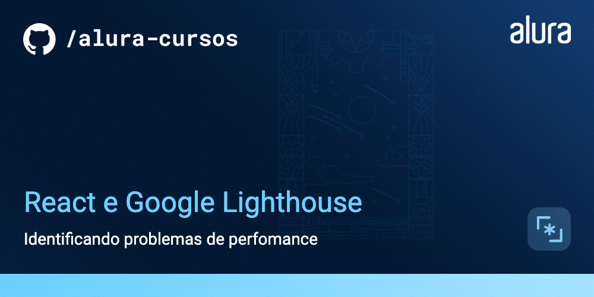

# ByteBooks

App de uma editora de livros fictícia.

Projeto base: https://github.com/alura-cursos/bytebooks-3/tree/curso-3/aula-1.3
## 🔨 Funcionalidades do projeto

O ByteBooks apresenta um catálogo de livros de tecnologia, com função de busca e responsividade para dispositivos móveis.

## ✔️ Técnicas e tecnologias utilizadas

Para a implementação do projeto foram utilizadas as seguintes técnicas e tecnologias:

- React
- TypeScript
- Tailwind
- Identificação de problemas de perfomance
  - Extensão Google Lighthouse
  - React.Profiler
  - Aba Profiler do React Dev Tools
- Memoização de componentes
  - React.lazy
  - useMemo
- Otimização de renderização
  - React.lazy
  - React.Suspense
  - Propriedade key
- Otimização de imagens e css
  - Formatos de imagem modernos (.webp, .avif)
  - Propriedade loading da tag 
  - Propriedade font-swap

## 📁 Acesso ao projeto

Você pode acessar o [código fonte do projeto](https://github.com/alura-cursos/bytebooks/tree/main) ou [baixá-lo](https://github.com/alura-cursos/bytebooks/archive/refs/heads/main.zip).

## 🛠️ Abrir e rodar o projeto

Após baixar o projeto, abra o terminal na pasta do projeto e execute o comando `npm i` ou `npm install`.

Inicie o servidor de desenvolvimento com `npm run dev`.

Agora vá até seu navegador e acesse http://localhost:5173/ ou o link que o terminal do Vite indicar 🏆

## 📚 Mais informações do curso

Gostou do projeto e quer aprender como implementá-lo? Você pode [acessar o curso de React: identificando problemas de perfomance com o Google Lighthouse](https://www.alura.com.br/TBD).
